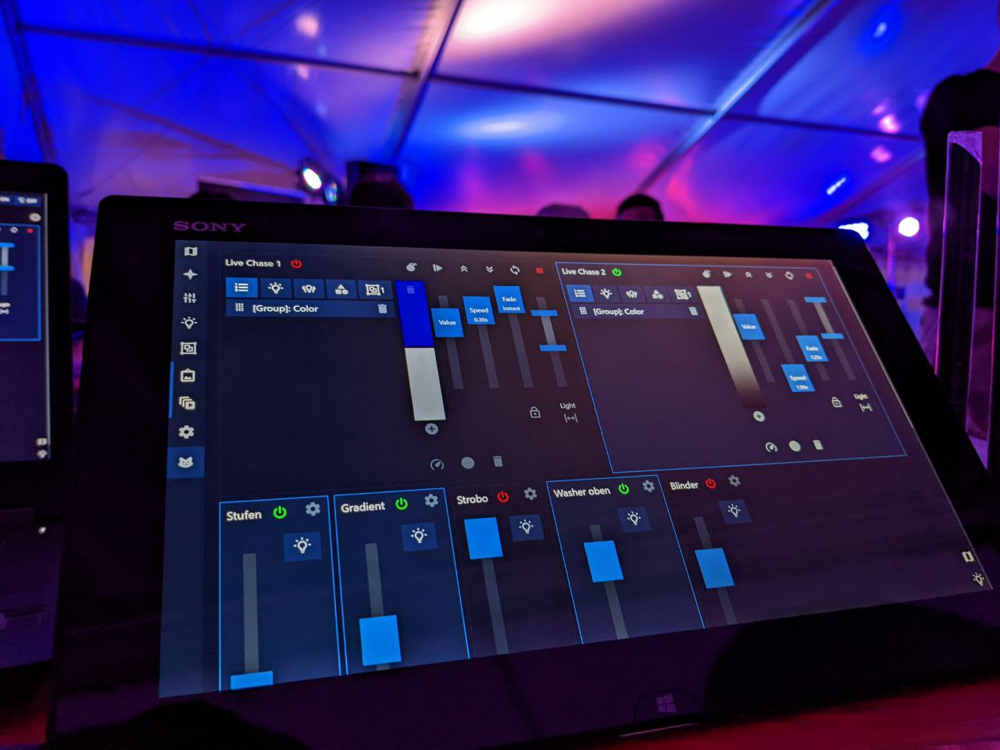

# vLight

Simple web-based DMX lights controller.



> **🚧 This project is still Work in Progress! 🛠️**
>
> It has been used for real events, but it's not battle-tested yet. **Use at your own risk**.
>
> Check out the [TODO list](./TODO.md) for the roadmap of planned features.
>
> Feel free to fork and experiment - PRs welcome.

> 🎵 Also check out this project's companion app [remote-mixer](https://github.com/kryops/remote-mixer) for remote-controlling sound mixers.

## Features

- 📱 Responsive and mobile-friendly
- 🚀 Lightweight and performant
- 🕸️ Connect multiple clients
- 🌓 Light and dark mode
- 📄 Configurable Dynamic Pages

Controls

- 🎚 DMX Channels
- 💡 Fixtures
- ꙮ Fixture Groups
- 🖼 Memories
- 🎞 Live Chases
- 🗺 Map Overview
- ✨ Universe Overview
- 🌎 Global Master / Blackout

Inputs

- 🖱 Mouse
- 📱 Touch
- ⌨️ Keyboard (partial)
- (Planned: 🕹 Physical input devices)

Supported DMX Interfaces

- ArtNet
- USB for [FX5](https://fx5.de/) and [Digital Enlightenment](http://www.digital-enlightenment.de/)
- [Custom Binary protocol via TCP/UDP](./backend/src/devices/vlight/README.md)

## Getting Started

### Using a Docker container

You can build and run this project through Docker (in a Linux container):

```
> ./docker-build.sh
> ./docker-run.sh
```

### Normal installation

Software needed:

- [Node.js](https://nodejs.org/en/)
- [Yarn](https://yarnpkg.com/lang/en/)

Build tools for native Node.js addons are also needed depending on your platform.

Install and setup:

```shellscript
> yarn
```

Start:

```shellscript
> yarn start
```

#### Windows Notes

The automatic installation of the Visual Studio Build tools does not include all features that are necessary to compile this project's addons. Find them under "Control Panel > Software / Apps & Features" and change the installation to contain the following features:

- Visual C++ ATL for x86 and x64

### Configuration

The base configuration is contained in the `config/vlight-config.js` file. It should offer documentation and auto-completion through TypeScript - otherwise, check out the [source](./backend/src/services/config.ts).

To switch projects, change the `project` setting. If you want to clone an existing project, just copy its folder inside the `config` directory.

The rest of the configuration is available in the UI:

- Fixture types are persisted globally
- All other entities and settings are persisted on a per-project basis

## Development

Start in development mode with hot reloading:

```shellscript
> yarn dev
```

### Protocols

[vLight Client Protocol via REST/WebSocket](./backend/src/services/api/README.md)

[vLight Binary Protocol via TCP/UDP](./backend/src/devices/vlight/README.md)
